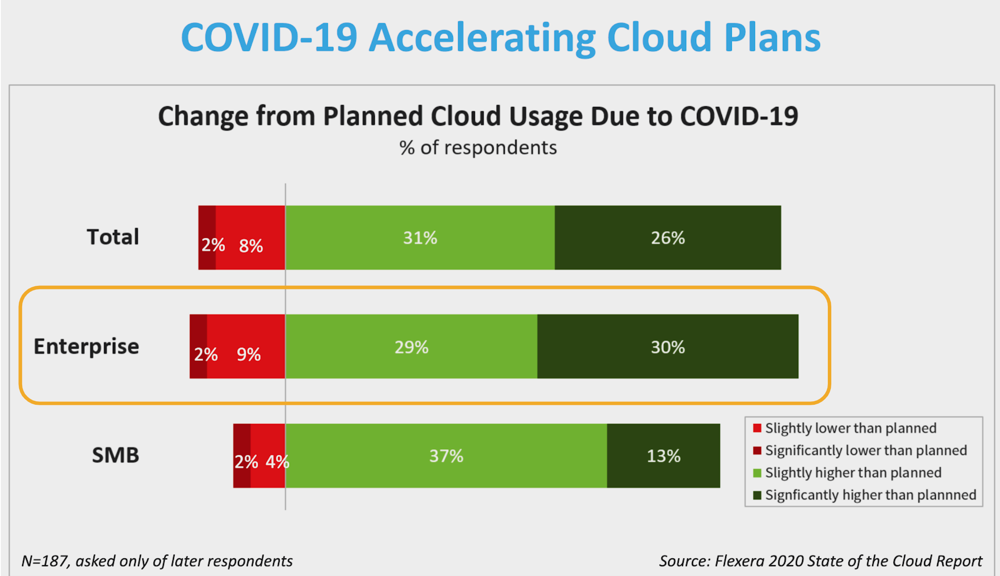
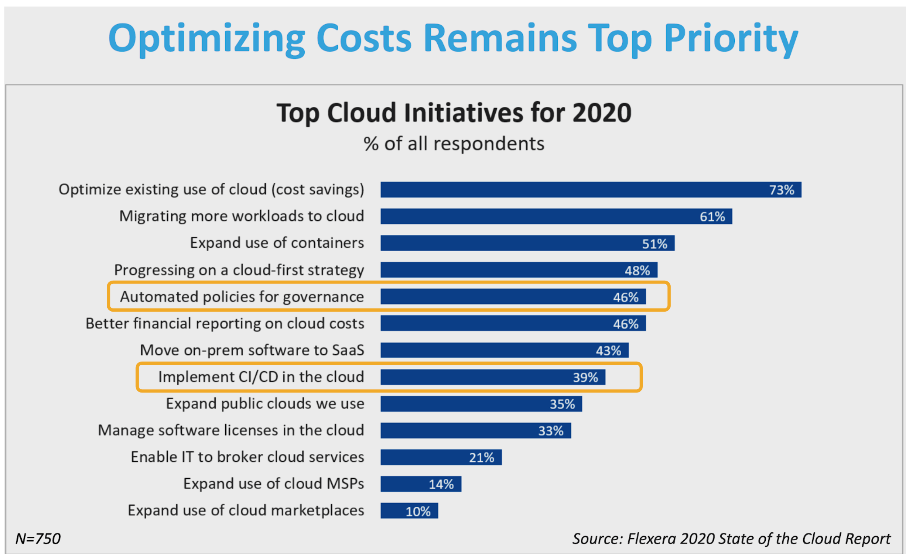

# All Day DevOps 2020

* [alldaydevops.com](https://www.alldaydevops.com/)
* 24 hours
* 180 speakers
* 158 countries (and growing)
* 6 tracks

&nbsp;

## Tracks

Below are the attended sessions quick recaps, along with useful resources personal notes :

* [CI/CD & Continuous Everything](https://khurdz.github.io/addo-2020/cicd-continuous-everything/)
* [Modern Infrastructure](https://khurdz.github.io/addo-2020/modern-infrastructure/)
* [DevSecOps](https://khurdz.github.io/addo-2020/devsecops/)
* [Cultural Transformation](https://khurdz.github.io/addo-2020/cultural-transformation/)
* [Site Reliability Engineering](https://khurdz.github.io/addo-2020/sre/)
* [Government](https://khurdz.github.io/addo-2020/government/)

&nbsp;

## Notes

* Throughout the keynotes and sessions, a lot of reminders about DevOps basic principles (culture & automation)
* Back to basics instead of over-focusing on Cloud, SaaS, tools...
* Focus on people first (culture & training), then adapt your processes, and afterwards work on tools/technology/solutions, not the other way around

&nbsp;

## Flexera 2020 State of the Cloud Report

* Covid-19 accelerating Cloud Plans
  * VDI and SaaS solutions in particular

* Optimizing costs remains top priority
  * Migration and container adoption are still top priorities
  * Automated policies for governance, and implement CI/CD *in* the Cloud are ranking up quickly this year

* Some figures available [here](https://www.flexera.com/about-us/press-center/flexera-releases-2020-state-of-the-cloud-report.html)
* Download full report [here](https://info.flexera.com/SLO-CM-REPORT-State-of-the-Cloud-2020)

&nbsp;

## The DevOps Roadmap

* [The original article back from 2018](https://medium.com/hackernoon/the-2018-devops-roadmap-31588d8670cb)
* The Github repository : [github.com/kamranahmedse/developer-roadmap](https://github.com/kamranahmedse/developer-roadmap)
* Short URL : [https://roadmap.sh/devops](https://roadmap.sh/devops)

